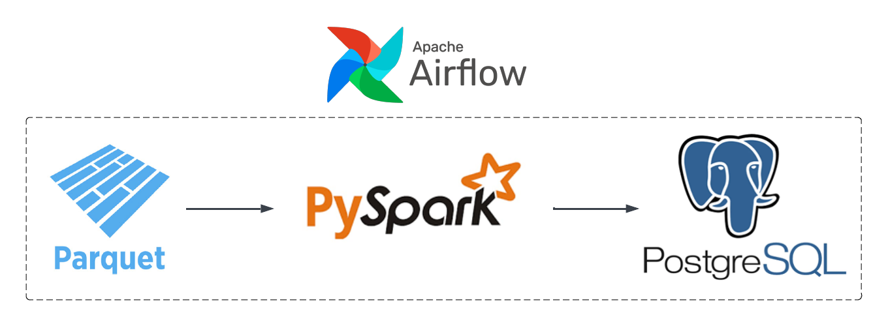

# Taxi Trip Data | Data Engineering Project

## Introduction
___
The goal of this project is to develop an ETL pipeline that reads in taxi trip data from a parquet file to a PySpark DataFrame, transforms the data, and loads it to a data model in a PosgreSQL database. The pipeline will be automated and orchestrated using Apache Airflow.

## Architecture 
___

## Technology Used
___
Programming Language: Python

* Apache Airflow
* Apache Spark
* PostgreSQL

## Dataset
___
TLC Trip Record Data 

Yellow and green taxi trip records include fields capturing pick-up and drop-off dates/times, pick-up and drop-off locations, trip distances, itemized fares, rate types, payment types, and driver-reported passenger counts.

Information about the dataset can be found here:
* Website: https://www.nyc.gov/site/tlc/about/tlc-trip-record-data.page
* Data Dictionary: https://www.nyc.gov/assets/tlc/downloads/pdf/data_dictionary_trip_records_yellow.pdf

## Data Model
___
